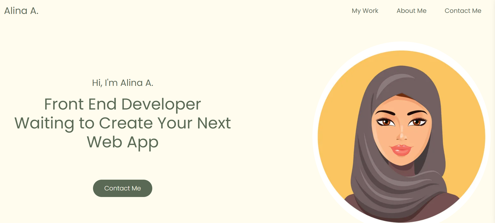

# Bootstrap_Portfolio
# Description 
This is my personal portfolio which has been created using HTML, CSS and bootstrap as required by the guidlines for this challenge in my front end web development bootcamp. The portfolio includes the following section: my work, skils, about me and contact me.
[Link to the deployed project](https://al946x.github.io/Bootstrap_Portfolio/)

# Screenshot 

# Installation
Clone the repo from github and run it on your local machine

# Usage
N/A

# Credits
N/A

# License
N/A
